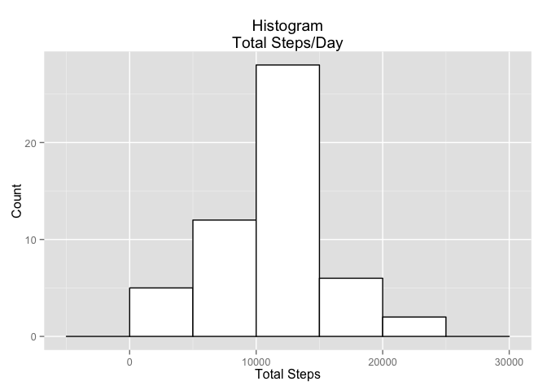
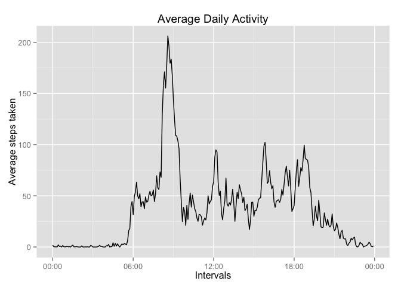
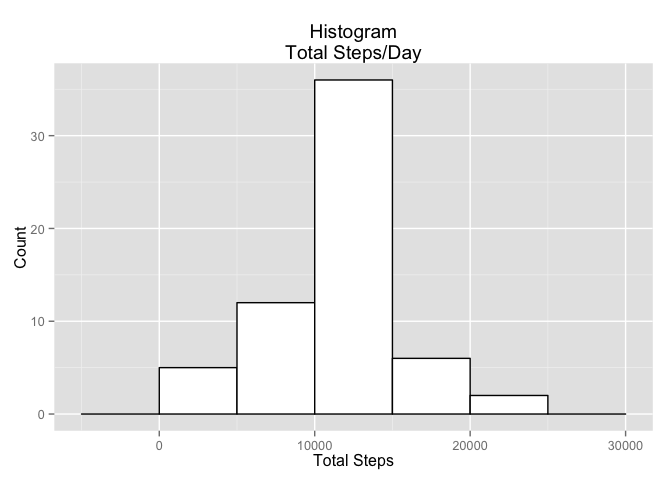
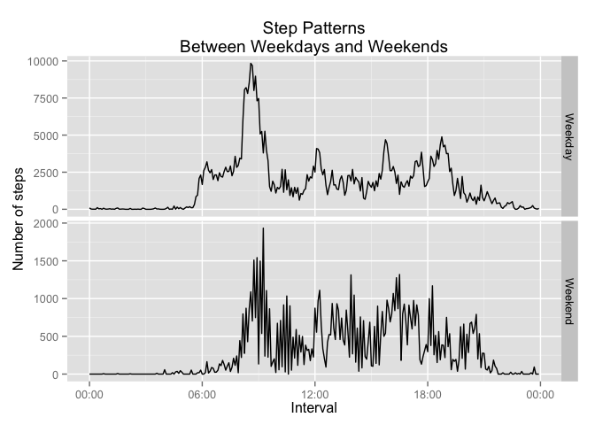

# Reproducible Research: Peer Assessment 1
Jorge Cabrita de Sousa  
8 Mar 2015  

## Read the csv and load Libraries
First we need to read the csv containing the data, and to load all the necessary libraries.
We will be using dplyr and ggplot2 during this essay.

```r
# load 'dplyr' whith suppressed startup messages
suppressPackageStartupMessages(library(dplyr))
# the same for 'ggplot2'
suppressPackageStartupMessages(library(ggplot2))
```
After carefull analysis of the forums, regarding the issue with time intervals, I opted for the use of some helper functions as sugested in the thread; I also used the scales package for some extra formatting.

```r
# I used the scales package as sugested in the forum so I could format the X-axis on some plots
suppressPackageStartupMessages(library(scales))
# helper functions to format time intervals
intToHHMM <- function (i) {  sprintf("%02d:%02d", i %/% 100, i %% 100)}
convert <- function(x) strptime(intToHHMM(x),format="%H:%M")

# read the data
data  <- tbl_df(read.csv("activity.csv"))
```
First we need to clean the original dataset for missing values.

```r
clean_data <- filter(data,!is.na(steps))   # remove missing values
```

### Q: What is the mean total number of steps taken per day?  
To answer the question, we group by *date* and summarize for *Total Number of Steps*.

```r
step_analysis <- group_by(data,date) %>%    # group by date
  summarize(total_steps = sum(steps, rm.na=TRUE)) # summarize the data
```

And plot the Histogram for *Total Number of Steps*:
 

From this we can also calculate the *Mean* and *Median* of the Total Number of Steps.

```r
mean_total_steps = round(mean(step_analysis$total_steps, na.rm=TRUE), digits=2)  ## calculate mean of total steps
median_total_steps = round(median(step_analysis$total_steps, na.rm=TRUE), digits=2)  ## calculate median of total steps
```

And so, we can conclude that the *mean* of the total number of steps is **10767.19** and the *median* of the total number of steps is **10766**;

###Q: What is the average daily activity pattern?
To answer this question we group by *interval* and summarize for *Average Number of Steps*.

```r
step_analysis2  <- group_by(data,interval) %>%  ## group by interval
  summarize(avg_steps = mean(steps, na.rm=TRUE))   ## summarize the data
```

And we plot the data as a line (as requested).
 

We also collect the maximum average *interval*.

```r
max_avg_interval = filter(step_analysis2, avg_steps==max(avg_steps)) ## show max avg interval
```

And conclude that the *interval* with the maximum average steps is **835**. 
 
###Q: Inputing missing values
To answer this question, we first compute the total number of rows with NA values.

```r
step_analysis3  <- filter(data, is.na(steps))   ## show total NA values
```

And we calculate that value to be: **2304**.
For the second part of this question we prepare a second dataset filling the missing data by replacing the *NA* values with the average values for each interval.

```r
data2  <- inner_join(data, step_analysis2, by="interval") %>% ## join by interval 
  mutate(new_steps=ifelse(is.na(steps), avg_steps, steps)) %>%  ## calculate avg steps
  select(date,interval,new_steps) ## clean the dataset
```

We then group by *date* and summarize for Total Number of Steps with the new values.

```r
step_analysis4 <- group_by(data2,date) %>%  ## group by date
  summarize(total_steps=sum(new_steps)) ## summarize
```

And we plot the Histogram of the Total Number of Steps
 

From this we can also calculate the *Mean* and *Median* of the Total Number of Steps.

```r
mean_total_steps2 = round(mean(step_analysis4$total_steps), digits=2)    ## calculate mean
median_total_steps2 = round(median(step_analysis4$total_steps), digits=2)  ## calculate median
```

And so, we can conclude that the *mean* of the total number of steps is **10766.19** and the *median* of the total number of steps is **10766.19**;

###Q: Are there differences in activity patterns between weekdays and weekends?
To answer this question we start from the *clean_data* dataset and mutate it, adding a column that identifies which are the Weekdays and which are the Weekends.

```r
step_analysis5 <- filter(data, !is.na(steps)) %>% ## clean missing values
  mutate(WeekDays=weekdays(as.Date(date)), fDay=ifelse(WeekDays==c("Sunday","Saturday"), "Weekend", "Weekday")) %>% ## add weekdays column
  group_by(interval,fDay)  %>% ## group by factors
  summarize(total_steps=sum(steps)) ## summarize
```

And we plot them sepparately, correcting the scale of both graphics in order to better understand each distribution.
 
